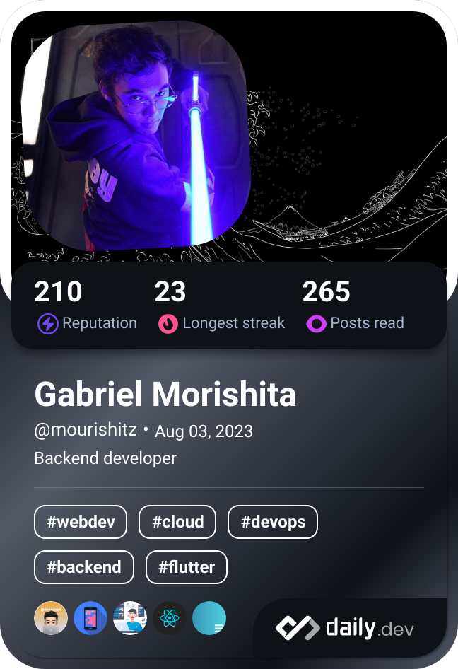

<h2> 
    
 Backend Developer 
 
    
 Computer Science on Universidade Cruzeiro do Sul 

</h2>

  
  
  
  
  
  

  
<h3 align="center">Um pouco mais sobre mim</h3>

*   🌍  São Paulo - Guarulhos
*   ✉️  Me manda um e-mail: [gabrielmorishita@hotmail.com](mailto:gabrielmorishita@hotmail.com)
*   🧠  Entusiasta Backend com uma pitada de Fullstack!
*   🎒  Utilizo como padrão de Commits o [GitMoji](https://gitmoji.dev/)
*    🵠Amo música! Inclusive agora estou escutando:  

 
    <h4>Da uma olhadinha nas redes sociais!</h4>
    
     
     
    
        
    

    <h4>Stack</h4>
    
    
    
    
    
    
    

